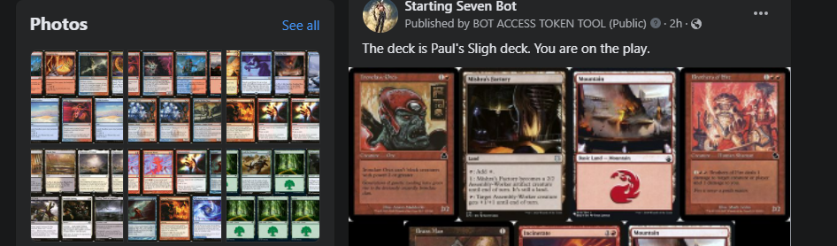

# StartingSevenBot
Code for simple facebook auto-shitpostbot. Draws a starting hand of 7 cards from a pre-loaded decklist and creates an image of it.
Check out the page [here](https://www.facebook.com/StartingSevenBot)!

- [x] Parse decklist txt file
- [x] Fetch images into directory with Scryfall API
- [x] Insert test decklist into text file
- [x] Concatenate images horizontally with Pillow
- [x] Generate starting 7 with decklist
- [x] Post to facebook with page token
- [x] Implement Schedule loop (copy from piBot)
- [x] Push to Heroku and adjust requirements for Heroku - see piBot
- [x] Swap to 4 up 3 down imaging with Pillow
- [x] Verify Heroku Account for extra hours
- [x] Convert MTGO dec file into required format
- [ ] Adjust functions to take dec input natively, not re-parse - save the deck in some new array
- [ ] Save generated hands in some archive folder based on deck
- [x] Add folder for decklists to go into and pull from there
- [ ] Cycle decklists - maybe every 10 posts (global counter on job())
